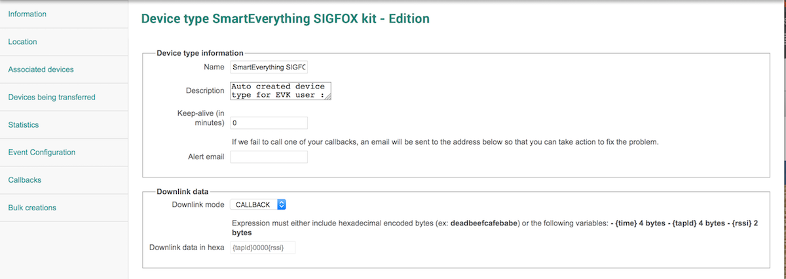
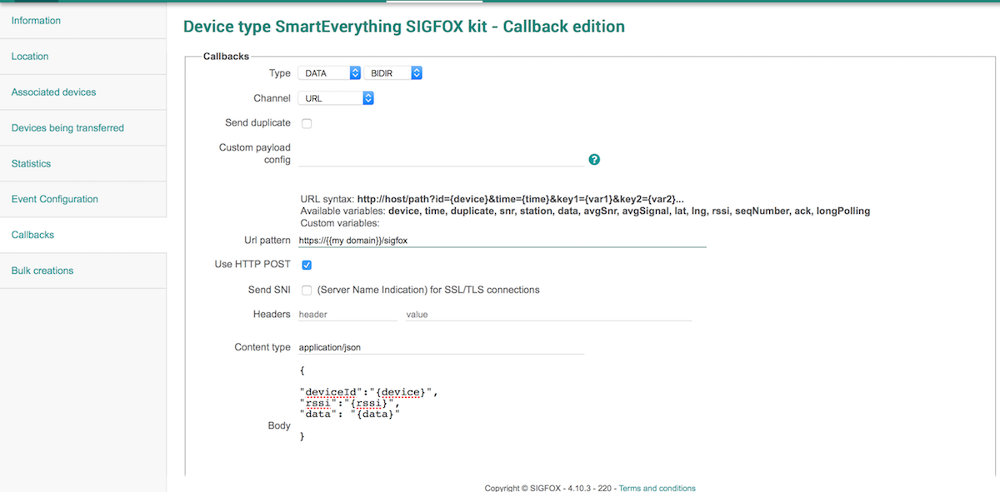

#SIGFOX - Downlink message with vanilla Php
##What ?


Using the [SIGFOX](http://makers.sigfox.com) website, you can send back some data to your connected device.
This basic sample code is here to help you set it up using PHP.

To do so, you need to associate the URL to call to the desired _device type_ (a group of similar devices).    

Every time one of these devices will request a downlink message, the URL will be called.
You need to send back an `HTTP 200 OK` response, and the **8 bytes** response.
In some cases, you may have no data to send, then simply reply with a `HTTP 204 No Content`. 

Your response must be sent with the following header: 
`Content-Type: application/json`, and the following format :

	{
	  '{{deviceId}}': {
    	'downlinkData':{{data}}
 	 }
	}


With `{{deviceId}}`being the device of the device requesting a message (to be extracted from the incoming request), and `{{data}}` your 8-bytes message.

##Set up your callback URL

* Log in your [SIGFOX](http://backend.sigfox.com) account.
* Navigate to the appropriate _device type_ menu
* Edit the device type, to set the _Downlink mode_ to _callback_
* In the _Callbacks_ menu, add a new one, with the following settings :
  * Type: DATA / BIDIR
  * Channel: URL
  * Url pattern : Your domain + endpoint
  * Check the POST checkbox
  * Content type : _application/json_
  * Body : customize to your needs
 
 For this example, the body was set as: 

	
	{
		"deviceId":"{device}",
		"rssi":"{rssi}",
		"data": "{data}"
	}






##Pre requisites

This example use Vanilla PHP. Check the [master branch](https://github.com/nicolsc/sigfox-downlink-php) for an example using Silex (+ composer for the dependencies).


* Php

##Install

###Mac OS X

```
$ brew install php70
```

##Run

```
$ php -S 127.0.0.1:4004
```